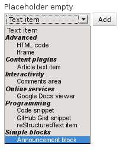
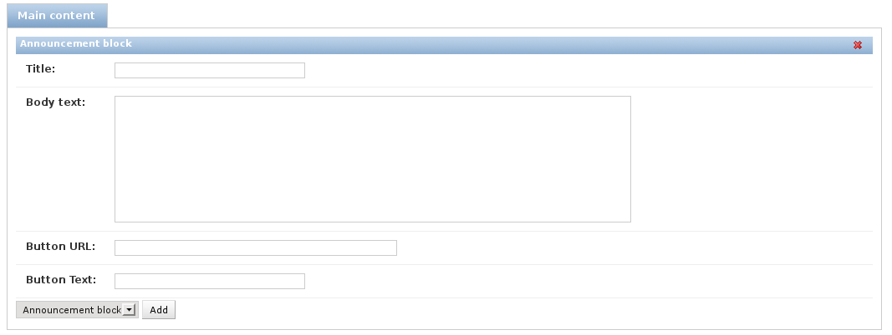

.. _newplugins:

Creating new plugins
====================

A plugin is a standard Django/Python package.
As quick example, let's create an announcement block.

This is a typical module that is found on many websites; a title text, some intro text and "call to action" button at the bottom.
Such item could be created in a WYSIWYG editor, but in this case we'll provide a clear interface for the redactional content.

The plugin can be created in your Django project, for example as the package ``plugins.announcementblock``.

Example code
------------

For the ``plugins.announcementblock`` package, the following files are needed:

* ``__init__.py``, naturally.
* ``models.py`` for the database model.
* ``content_plugins.py`` for the plugin definition.

models.py
~~~~~~~~~

The models in :file:`models.py` needs to inherit from the :class:`~fluent_contents.models.ContentItem` class,
the rest is just standard Django model code.

.. code-block:: python

  from django.db import models
  from django.utils.translation import ugettext_lazy as _
  from fluent_contents.models import ContentItem

  class AnnouncementBlockItem(ContentItem):
      """
      Simple content item to make an announcement.
      """
      title = models.CharField(_("Title"), max_length=200)
      body = models.TextField(_("Body text"))

      button_link = models.URLField(_("Button URL"))
      button_text = models.CharField(_("Button Text"), max_length=200)

      class Meta:
          verbose_name = _("Announcement block")
          verbose_name_plural = _("Announcement blocks")

      def __unicode__(self):
          return self.title

This :class:`~fluent_contents.models.ContentItem` class provides the basic fields to integrate the model in a placeholder.
The ``verbose_name`` and ``__unicode__`` options are used later on to display the model.

content_plugins.py
~~~~~~~~~~~~~~~~~~

The :file:`content_plugins.py` file can contain multiple plugins, each should inherit from the :class:`~fluent_contents.extensions.ContentPlugin` class.

.. code-block:: python

  from django.utils.translation import ugettext_lazy as _
  from fluent_contents.extensions import plugin_pool, ContentPlugin
  from .models import AnnouncementBlockItem

  class AnnouncementBlockPlugin(ContentPlugin):
     model = AnnouncementBlockItem
     render_template = "plugins/announcementblock.html"
     category = _("Simple blocks")

  plugin_pool.register(AnnouncementBlockPlugin)

The plugin class binds all parts together; the model, metadata, and rendering code.
Either the :func:`~fluent_contents.extensions.ContentPlugin.render` function can be overwritten, or a ``render_template`` can be defined.
Finally, the plugin should be registered.

announcementblock.html
~~~~~~~~~~~~~~~~~~~~~~

The default :func:`~fluent_contents.extensions.ContentPlugin.render` code makes the model instance available as the ``instance`` variable.
This can be used to generate the HTML:

.. code-block:: html+django

    

        <h3>{{ instance.title }}</h3>
        

            {{ instance.body|linebreaks }}
        

        
<a href="{{ instance.button_url }}">{{ instance.button_text }}</a>

    

Wrapping up
~~~~~~~~~~~

The plugin is now ready to use.
Don't forget to add the ``plugins.announcementblock`` package to the ``INSTALLED_APPS``, and create the tables::

    ./manage.py syncdb

Now, the plugin will be visible in the editor options:

After adding it, the admin interface will be visible:

The appearance at the website, depends on the sites CSS theme off course!

This example showed how a new plugin can be created within 5-15 minutes!

Customizing the frontend rendering
----------------------------------

The :class:`~fluent_contents.extensions.ContentPlugin` class renders the plugin using the following options:

* a ``render_template`` attribute or :func:`~fluent_contents.extensions.ContentPlugin.get_render_template` method.
  This is the recommended approach for complex content.
  Optionally, :class:`~fluent_contents.extensions.ContentPlugin.get_context` can be overwritten to provide more context.

* A custom :func:`~fluent_contents.extensions.ContentPlugin.render` method.
  This may be suitable if there is very little output to render.

As example, this is the render function of the :ref:`text <text>` plugin:

.. code-block:: python

    def render(self, instance, request, **kwargs):
        return mark_safe('
' + instance.text + '
\n')

.. note::

    Unless the content is meant to be used as HTML, it should be escaped with the :func:`django.utils.html.escape` function.

The standard :func:`~fluent_contents.extensions.ContentPlugin.render` method takes the template
from :func:`~fluent_contents.extensions.ContentPlugin.get_render_template`,
and uses the context provided by :func:`~fluent_contents.extensions.ContentPlugin.get_context`.
The rendering context is wrapped in a :func:`~fluent_contents.extensions.PluginContext`,
which is similar to the :class:`~django.template.context.RequestContext` that Django provides. This ensures that
variables such as ``STATIC_URL`` and ``request`` are available in the plugin templates.

Customizing the admin interface
-------------------------------

The plugin is rendered as an inline model admin, which is - by design - mostly controlled outside the plugin class.
The :class:`~fluent_contents.extensions.ContentPlugin` class does define extra options to hook into the admin interface.

General metadata
~~~~~~~~~~~~~~~~

* The plugin title is determined by the :attr:`~fluent_contents.extensions.ContentPlugin.verbose_name` property,
  which reads the ``verbose_name`` of the model by default.
* The category is defined by setting the ``category`` attribute.

Defining the form layout
~~~~~~~~~~~~~~~~~~~~~~~~

The admin form and template can be replaced, using;

* ``admin_form = ...`` allows changing the used admin form. By default this is a :class:`~fluent_contents.forms.ContentItemForm`.
* ``admin_form_template = ...`` allows changing the admin form template. Reasonable defaults are:

 * ``admin/fluent_contents/contentitem/admin_form.html`` - a standard template that displays all the fields.
 * ``admin/fluent_contents/contentitem/admin_form_without_labels.html`` - a similar template that displays form fields without labels(also known as :attr:`~fluent_contents.extensions.ContentPlugin.ADMIN_TEMPLATE_WITHOUT_LABELS`

* ``class Media`` can be used to add extra JavaScripts and CSS files to the admin interface.

Inserting JavaScript behavior
~~~~~~~~~~~~~~~~~~~~~~~~~~~~~

When adding a JavaScript file through the ``Media`` class, it can register it self as "view handler".
In case of the Announcement Block plugin, the generic signature of the file would look like:

.. code-block:: javascript

    (function($){

      function AnnouncementBlockItem() { }

      AnnouncementBlockItem.prototype.enable = function(fs_item)
      {
          var inputs = fs_item.find("input");
          // ... update the items
      };

      AnnouncementBlockItem.prototype.disable = function(fs_item)
      {
          // deinitialize, if needed
      };

      // Register the view handler for the 'AnnouncementBlockItem' model.
      cp_plugins.register_view_handler('AnnouncementBlockItem', new AnnouncementBlockItem());

    })(window.jQuery || django.jQuery);

The ``enable()`` and ``disable()`` functions are called when
a plugin is added to the admin screen, and when it is removed.
This can also happen when a plugin is moved to another placeholder.
Both functions receive the FormSet item node as ``jQuery`` object.

The :ref:`text plugin <text>` uses this feature for example to enable or disable the WYSIWYG editor.
